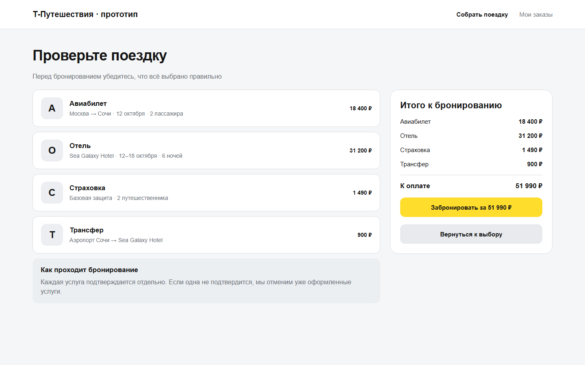
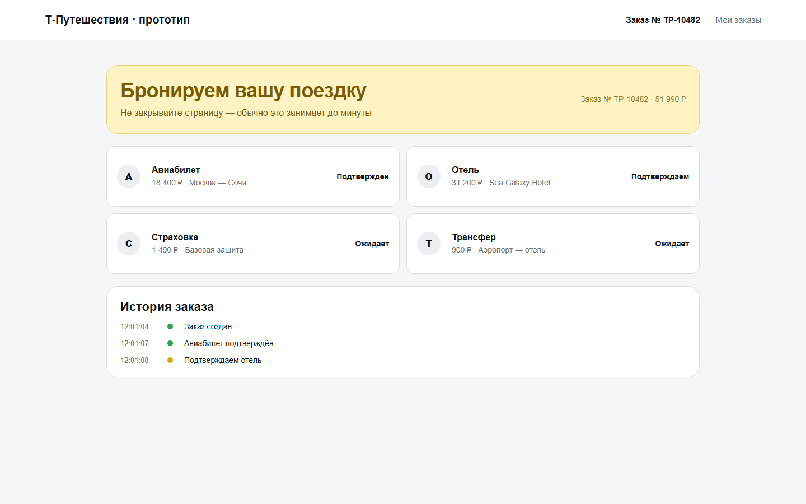
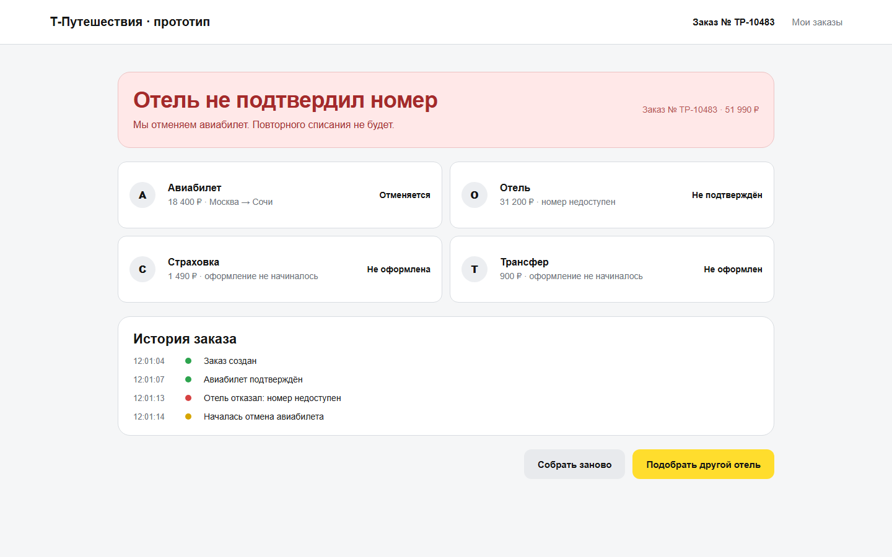

# T‑Amada Frontend

> Клиентское приложение для сборки составной поездки и прозрачного отслеживания бронирования авиабилета, отеля, страховки и трансфера.

## О проекте

T‑Amada — командный учебный проект проектного практикума Т‑Банка. Пользователь собирает одну поездку из четырёх независимых услуг, а интерфейс показывает, что происходит с каждой из них во время бронирования.

Главная сложность — частичный сбой. Например, авиабилет уже подтверждён, а отель отказал. Оркестратор запускает компенсацию, а frontend должен понятно показать причину ошибки, отменяемые услуги и всю историю заказа.

Этот репозиторий — моя публичная frontend-версия проекта. Командная разработка ведётся в [основном репозитории](https://github.com/fezugicrix/t-amada-frontend), а сюда я переношу и оформляю выполненную мной клиентскую часть.

## Моя роль

**Александр Симченко — Frontend Developer / Team Lead.**

- проектирую и реализую пользовательский сценарий от выбора услуг до результата бронирования;
- отвечаю за экран состояния заказа и timeline событий;
- согласовываю контракт между frontend и backend;
- декомпозирую задачи, слежу за зависимостями и качеством демонстрации.

## Что уже есть

- 8 экранов полного пользовательского сценария;
- выбор авиабилета, отеля, страховки и трансфера;
- итоговая проверка заказа и общей стоимости;
- состояния выполнения, успеха и частичного сбоя;
- понятная визуализация компенсации после отказа поставщика;
- timeline ключевых событий заказа.

  
  

## Статус проекта

Проект находится в активной разработке. Сейчас доступен статический UI-прототип; следующая цель — перенести сценарий на React + TypeScript и подключить API оркестратора.

- [x] продуктовый сценарий и основные состояния;
- [x] первый визуальный прототип;
- [ ] компонентная архитектура на React + TypeScript;
- [ ] интеграция поиска предложений и создания заказа;
- [ ] обновление статусов через polling или SSE;
- [ ] восстановление заказа по `orderId` после перезагрузки;
- [ ] тесты happy path, отказа отеля и компенсации.

Подробности: [roadmap](docs/roadmap.md) · [архитектура](docs/architecture.md)

## Ключевые сценарии

1. Все поставщики подтверждают услуги — заказ получает статус `COMPLETED`.
2. Отель отказывает после подтверждения авиабилета — начинается компенсация.
3. Повторный запрос не создаёт второй заказ благодаря `idempotencyKey`.
4. После перезапуска состояние заказа восстанавливается, а интерфейс продолжает показывать актуальный прогресс.

## Запуск прототипа

Откройте [`index.html`](index.html) в браузере или используйте [онлайн-версию](https://ssimchenko.github.io/t-amada-frontend/). На странице собраны все восемь экранов сценария.

---

Учебный проект. Не является официальным продуктом Т‑Банка и не выполняет реальные бронирования или платежи.
