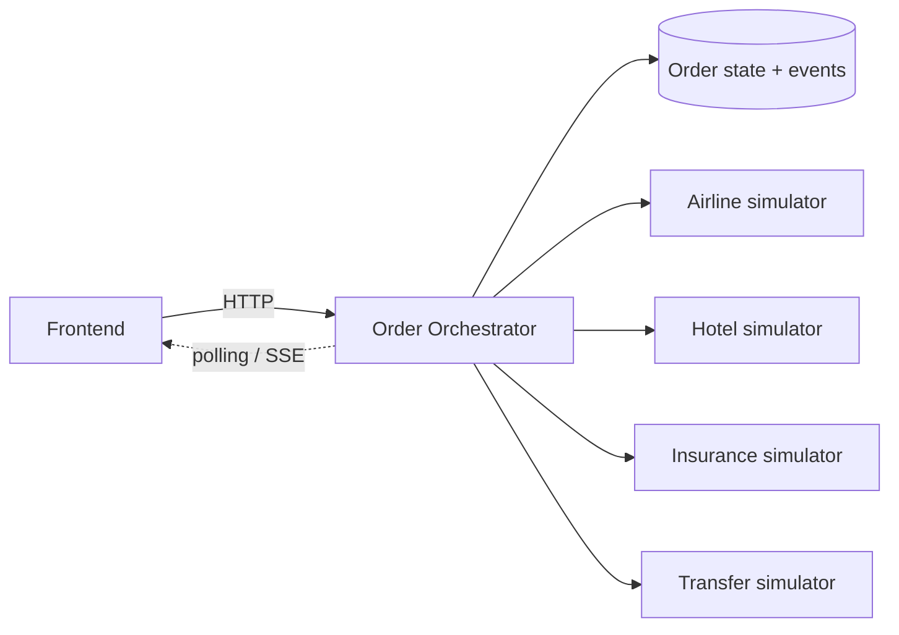

# Архитектура frontend

## Контекст

Составной заказ объединяет четыре независимые услуги: авиабилет, отель, страховку и трансфер. Каждая услуга подтверждается своим поставщиком и может завершиться успешно, с отказом или с неопределённым результатом после таймаута.



Оркестратор использует Saga-подход: хранит прогресс, запускает следующие шаги и выполняет отдельные компенсирующие операции после частичного успеха.

## Ответственность клиента

- собрать выбранные `offerId` в один запрос;
- создать `idempotencyKey` для защиты от случайного повторного клика;
- показывать общий статус и состояние каждой услуги отдельно;
- переводить машинные коды ошибок в понятные сообщения;
- отображать timeline событий и компенсирующих операций;
- восстанавливать экран заказа по `orderId` из URL;
- получать обновления через polling, затем при необходимости через SSE.

Защита от дублей обеспечивается сервером. Отключение кнопки на клиенте улучшает UX, но не заменяет идемпотентность API.

## Состояния

### Составной заказ

`CREATED` → `PROCESSING` → `COMPLETED`

При частичном сбое: `PROCESSING` → `COMPENSATING` → `CANCELLED` или `MANUAL_REVIEW`.

### Отдельная услуга

`PENDING` → `PROCESSING` → `CONFIRMED`

Возможные отклонения: `FAILED`, `UNKNOWN`, `COMPENSATING`, `CANCELLED`.

`UNKNOWN` важен для таймаутов: отсутствие ответа ещё не означает, что поставщик не выполнил операцию.

## Ожидаемый API-контракт

```http
GET  /offers
POST /orders
GET  /orders/{orderId}
GET  /orders/{orderId}/events
POST /orders/{orderId}/cancel
```

Клиент ожидает стабильные коды ошибок, например `PRICE_CHANGED`, `OFFER_UNAVAILABLE`, `SUPPLIER_TIMEOUT` и `COMPENSATION_FAILED`.
